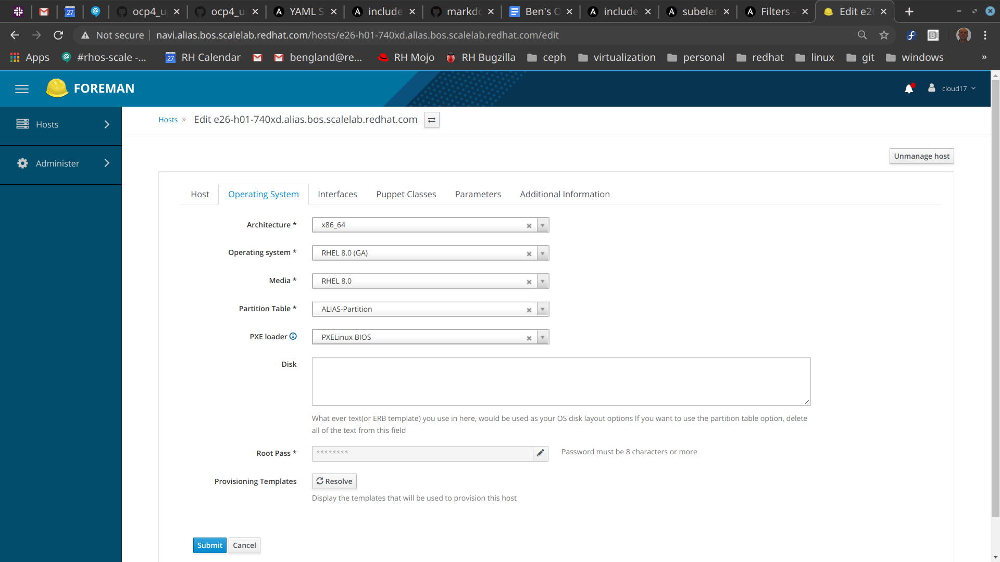

This repo contains 2 ansible playbooks for implementing Dustin Black's method for doing OpenShift 4 UPI installation 
on bare metal machines.   Dustin's document is [at this link](https://docs.google.com/document/d/1hl2qVWyRjqhKT3ZR5Q2xn9Ip1DLShanxQcnp11Zf1tw/edit?ts=5e5462d2#heading=h.f51z993ev25
).   For a link to openshift-install support for bare metal machines, [see this documentation](https://github.com/openshift/installer/blob/master/docs/user/metal/install_upi.md).

# restrictions (at this time)

1) supports only Alias and Scale Lab
2) supports only baremetal at this time (no clouds)
3) public interface is assumed to be slow
4) qinq-0 network configuration (each interface has separate VLAN)
5) cluster must start out on RHEL8/Centos8 - RHEL7 not supported
6) playbooks must run on Linux (Fedora 31, RHEL8 tested)

# where to run the playbook

You can run it from a host totally outside your cluster, or you can run it from the "deployer" = provisioning host.  If you do the latter, the playbook will be interrupted when it gets to the reboot, which is necessary as part of the upgrade of RHEL.   That's ok, just login after the reboot and restart the playbook, it should skip that set of tasks and move on from there.  It will discover that the block "upgrade to latest RHEL GA" has already been executed.

# discovery phase

The first step happens when you get your lab reservation.  At this time, 
we *require that RHEL8/Centos8 be installed on your deployer, masters and workers* - RHEL7 will not work.  This change can be done with Foreman GUI in Alias, for example.   Go into each host, use "Operating System" tab, fill it out like this:



Afterwards, you want your machines to look like this in Foreman:


You then rebuild them using the 'Select Action' button, you should get a dialog box like this one:


After the RHEL8 rebuild completes, you can then discover information about your cluster using ansible fact-gathering.  To get started:

```
# dnf install -y git ansible
```

Once that's done, pull deploy playbooks and configure them:
```
# git clone https://github.com/bengland2/ocp4_upi_baremetal
# cd ocp4_upi_baremetal
```

You must ensure that you have password-less ssh access to all the machines in your cluster inventory,  
so that password-less ssh is possible (ansible depends on this).  

* You may need to create a public-private key pair if you haven't already done this, with ssh-keygen.  
* If necessary, clear out ~/.ssh/known_hosts entries for previous incarnations of these hosts.  
* This playbook will get your public key installed on all the machines that you'll be using:

Construct an input inventory file to define 3 host groups:

* deployer - only one host in this group, it provides services to the entire cluster such as DHCP, HTTP, PXE, DNS, and NTP.
* masters - usually 3 of them, this provides OpenShift Kubernetes management infrastructure.   If there are no workers, apps can be run on them too
* workers - can be 0 to ... well we don't know yet.   Usually apps and OCS run here, as well as workload generators.

For example, here's **inventory.yml.sample**:
```
[deployer]
e26-h01-740xd.alias.bos.scalelab.redhat.com machine_type="740xd"

[masters]
e26-h03-740xd.alias.bos.scalelab.redhat.com machine_type="740xd"
e26-h05-740xd.alias.bos.scalelab.redhat.com machine_type="740xd"
e26-h07-740xd.alias.bos.scalelab.redhat.com machine_type="740xd"

[workers]
e26-h09-740xd.alias.bos.scalelab.redhat.com machine_type="620"
```

The machine type has to be recognizable as one of the types
in **lab_metadata.yml**.   This metadata file defines properties of each machine type:

* deploy_intf - high-speed NIC port used to deploy OpenShift 
* public_intf - low-speed NIC port to outside world, disabled on OpenShift machines
* data_intf - 2nd high-speed NIC port for use by OpenShift apps
* disabled_intfs - which network interfaces should be disabled on OpenShift machines
* badfish_boot_order - director record to use for this type of machine

This allows you to avoid defining the variables needed by the
playbook for each machine or machine type.   

Now run the playbook to install public key (and python if necessary):

```
ansible-playbook --ssh-common-args '-o StrictHostKeyChecking=no' \
  -i inventory.yml -e ansible_ssh_pass=TakeAWildGuess install_public_key.yml 
```

You run the discover_macs.yml playbook one time, to generate an inventory file with mac addresses defined for all machines.   

```
ansible-playbook -vv -i inventory.yml discover_macs.yaml
```

This should output a file named **~/inventory_with_macs.yml** by default - it will look the same as your previous inventory but with per-host deploy_mac variable added to each record.   From now on, you use this as your inventory file, not the preceding one.

Then define your cluster parameters by doing:

```
cd group_vars
cp all.yml.sample all.yml
<edit all.yml>
cd ..
```

# deployment phase

At present the playbook allows use of subscription-manager to get most up-to-date RHEL8 repos.   However, this is not automated, for security reasons.   The subscription-manager password is your Kerberos password and we don't want that showing up on all the lab systems, which are not secure.    So you have to manually login and turn on subscription manager if you want it.   You need to do just one command on the deployer:

```
subscription-manager register
Username:your-account@redhat.com
Password:your-password
```
Or you can provide repo files that point to an internal site like this one:

http://download.lab.bos.redhat.com/released/RHEL-8/8.1.0/

Now you prepare your deployer host with:

```
ansible-playbook -i ~/inventory_with_macs.yml ocp4_upi_baremetal.yml
```

This playbook can be used whenever a re-install of the deployer host is needed, regardless of what state the masters and workers are in, because the mac addresses never change.

Dustin's document describes what the playbook should be doing.  This will take a long while, and may involve the reboot of the deployer host and download of RHCOS and openshift.   When it finishes, you will have a deployer host that is set up to install masters and workers.   We do not actually install the masters and workers in this playbook.   

To start master and worker installation, from the deployer host use the installed **badfish.sh** for Dell machines.  It applies commands to a list of hosts in a file.  At present, it does not support SuperMicro machines, but should work with most Dell machines (that have Redfish API).    See Dustin's notes about supermicro alternative procedures.   **badfish.sh** depends on the **QUADS_TICKET** environment variable defined in **~/.bashrc**  .

```
cd
source ~/.bashrc
badfish.sh masters.list -t director
badfish.sh masters.list --check-boot
<keep doing this until you see "Current boot order is set to: director">
badfish.sh masters.list --pxe
badfish.sh masters.list --power-cycle
```

A new badfish-parallel.sh does all machines simultaneously.   This works really well in a scale-lab-sized deployment for workers, and is highly recommended there.  Example:

```
badfish-parallel.sh workers.list --check-boot
```

If all goes well, then the CoreOS and ignition files will be pulled onto all of these machines and they should reboot and join the OpenShift cluster.  Once that has happened, you can then install the workers with the same procedure, substituting workers.list for masters.list.

For supermicros, you need to do the following:
```
for node in `cat supermicro-workers.list`; do ipmitool -U quads -P $password -H $node chassis bootdev pxe; done
for node in `cat supermicro-workers.list`; do echo $node; ipmitool -U quads -P $password -H $node chassis power reset; done
```

To monitor installation from OpenShift perspective, use this command sequence:

```
cd ignition
openshift-install wait-for bootstrap-complete --log-level debug
```

when this shows that OpenShift cluster has formed, then shut off the bootstrap with

```
virsh destroy ocp4-upi-bootstrap
```

# post-installation tasks

For any tasks which have to be done to the openshift cluster after it is created, 
you can run this playbook *from your deployer host*:

```
cd
ansible-playbook --ssh-common-args '-o StrictHostKeyChecking=no' \
   -i post_install_inventory.yml post_install.yml
```

This has to be run there because it uses hostnames like "master-0" 
that aren't defined outside of the cluster.  
It is leveraging the DNS server (dnsmasq) in the deployer host.

At present this playbook:
- makes the deployer host a time server for the OpenShift hosts using the deploy_intf network.  Ceph (OpenShift Container Storage) depends on time synchronization.  
- approves CSRs which workers need.  Without this step, workers won't join the OpenShift cluster.


# resetting machines to initial state

When you are done with the cluster, or if you want to re-install from scratch, use the next command to revert the boot order to the original state that the QUADS labs and Foreman expect.   

```
for typ in masters workers ; do badfish.sh $typ.list -t foreman ; done
badfish.sh masters.list --check-boot
badfish.sh workers.list --check-boot
<keep doing this every 5 min until you see "Current boot order is set to: foreman">
```


# troubleshooting notes

To get a good log of the run so that others can see what happened, try adding this to end of your playbook command:

```
ansible-playbook ...  2>&1 | tee r.log
```

This playbook is designed to minimize repeated tasks by checking to see if a group of tasks are necessary or not - this feature is particularly nice when running the playbook from outside red hat (i.e. on your laptop from home).   This is somewhat problematic if the configuration changes and you re-run the playbook.   Look for tasks named "see if…"  and you can force the playbook to re-run those steps in most cases by just deleting some configuration file from the deployer host.  If needed, we can add a "force" option to make it skip this optimization later.

The slowest step in the installation procedure is download of RHCOS.  If you have to repetitively download the entire RHCOS directory (pointed to by rhcos_url in group_vars/all.yml), because of multiple sites or lab incarnations , then download to a local directory and then get it from there.   The rest of the playbook takes about 20 min to run, even from a remote laptop.

To see whether masters and workers are pulling files from httpd service on the deployer host:

```
tail -f /var/log/httpd/\*log
```

To see whether DHCP and TFTP requests are being received by the deployer host:

```
journalctl -f
```

To see whether bootstrap node is ready for masters, do the next command -- you want to see it trying to talk to the masters to establish a cluster quorum, it should be getting either node unreachable, connection refused, or invalid cert (master is from previous incarnation of cluster):

```
ssh core@bootstrap journalctl -f
```

To see whether CoreOS is installing, watch the console for a master node or worker node.   Normally, the PXE boot
installs CoreOS image using the kernel boot line at the top, and then the system reboots to CoreOS on disk.  It next
pulls ignition files using HTTP GETs logged on console.   When that succeeds, then it reboots again, and at this point
the node knows enough to try to join the cluster.   Monitor its progress there with.

```
oc get nodes
```
Finally, when the cluster quorum is formed, see if it is making progress using:

```
oc get co
```
which shows operators being installed and brought online.

